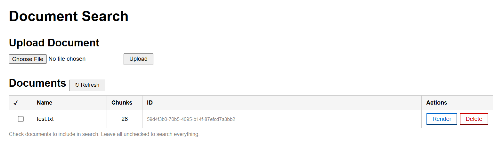
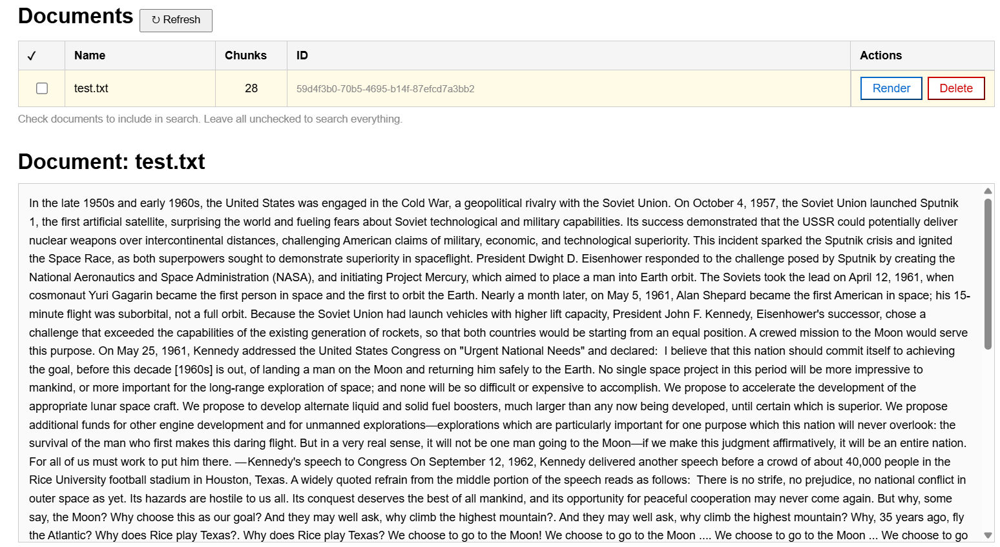
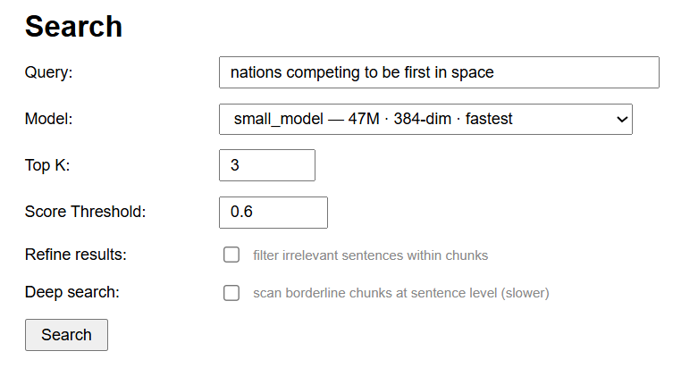
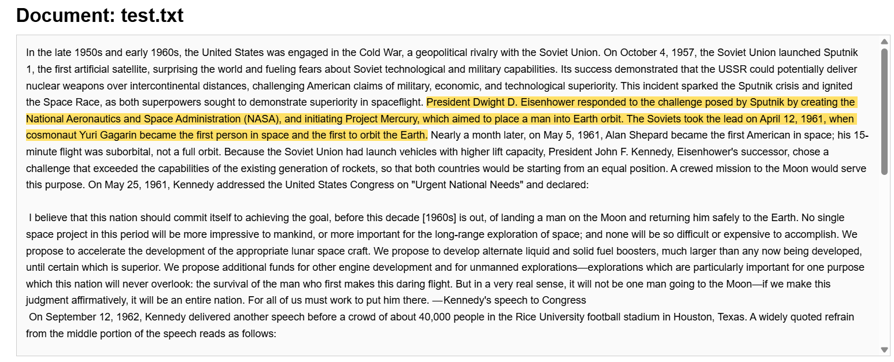
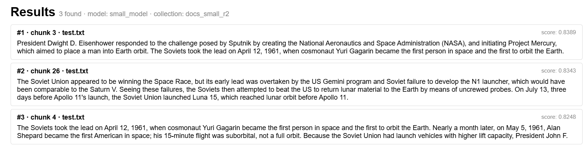

# semantic-search-app

Experimental prototype of a semantic search app using IBM Granite embedding models.

A microservices-based vector search engine that indexes `.txt` documents and retrieves 
relevant content using dense embeddings.

Supports three IBM Granite embedding models (small English, normal English, multilingual),
optional sentence-level result refinement, and deep search for borderline chunks.
Deployable locally via Docker Compose or in a Kubernetes cluster via Minikube.

## Usage Example

### Test Document

`docs/test.txt` - document provided for quick testing 
> Source: [Apollo 11 — Wikipedia](https://en.wikipedia.org/wiki/Apollo_11)

---

### Step-by-step Guide

**1. Open the app in your browser**

Navigate to `http://localhost:8080`.

**2. Upload the document**

Click **Choose File**, select `test.txt`, then click **Upload**.


**3. Wait for embedding to complete**

The document will be indexed across all three embedding models. For a small document this takes 10–20 seconds. A larger document (200+ chunks) may take several minutes.



**4. Render the document**

Click the **Render** button next to the document name to display the full text. After a search, matched sentences will be highlighted in yellow.



**5. Configure search parameters**

Fill in the search query and adjust parameters as needed:

| Parameter | Suggested value | Notes |
|---|---|---|
| Query | `nations competing to be first in space` | Try in other languages too with the multilingual model |
| Model | `small_model` | Fastest for testing |
| Top K | `3` | Number of results |
| Score Threshold | `0.6` | Lower = more results |



**6. Run the search**

Click **Search** and wait for results. Each result shows the similarity score, chunk index, and source filename.




## Architecture

```
                  ┌─────────────────────────────┐
                  │           Browser           │
                  └──────────────┬──────────────┘
                                 │ HTTP :8080
                                 ▼
                  ┌─────────────────────────────┐
                  │         API Gateway         │
                  │      (serves frontend)      │
                  └──────────────┬──────────────┘
                                 │
                       ┌─────────┴───────────┐
                       │                     │
                       ▼                     ▼
                 ┌─────────────┐     ┌──────────────┐
                 │  Document   │     │    Search    │
                 │  Service    │     │    Service   │
                 │   :8001     │     │     :8002    │
                 └─────┬───────┘     └───────┬──────┘
                       │                     │
                       └──────────┬──────────┘
                                  │
                                  │
                ┌─────────────────┴─────────────────┐
                ▼                                   ▼
┌─────────────────────────────┐     ┌─────────────────────────────┐
│        Model Service        │     │           Qdrant            │
│    IBM Granite Embeddings   │ ──► │       Vector Database       │
│          :8000              │     │          :6333              │
└─────────────────────────────┘     └─────────────────────────────┘
```

### Services

| Service | Port | Description |
|---|---|---|
| gateway | 8080 | API gateway + frontend |
| document-service | 8001 | Document upload, indexing, retrieval |
| search-service | 8002 | Vector search with refine and deep search |
| model-service | 8000 | IBM Granite embedding inference |
| qdrant | 6333 | Vector database |

### Embedding Models

| Model key | Model | Dims | Use case |
|---|---|---|---|
| `small_model` | granite-embedding-small-english-r2 | 384 | Fast, English |
| `normal_model` | granite-embedding-english-r2 | 768 | Accurate, English |
| `multilingual_model` | granite-embedding-278m-multilingual | 768 | Multilingual |

---

## Prerequisites

- [uv](https://github.com/astral-sh/uv) — Python package manager
- [Docker Desktop](https://www.docker.com/products/docker-desktop/)
- [Minikube](https://minikube.sigs.k8s.io/) _(for Kubernetes deployment)_
- [kubectl](https://kubernetes.io/docs/tasks/tools/) _(for Kubernetes deployment)_

---

## Configuration

Copy `.env.example` to `.env` and fill in the values:

```bash
cp .env.example .env
```

The `.env` file is used by Docker Compose. 
For Minikube, configuration is managed via `minikube/configmaps/services-config.yml`.

---

## Docker Compose

### Build

**PowerShell**
```powershell
.\scripts\ps1\build.ps1
```

**bash**
```bash
bash ./scripts/sh/build.sh
```

### Run

```bash
docker-compose up --no-build
```

Access the app at `http://localhost:8080`.

---

## Minikube

### Start Minikube

```bash
minikube start --cpus 4 --memory 6144
```

<details>

<summary>PowerShell</summary>

### Load images

```powershell
.\scripts\ps1\load-images.ps1
```

### Deploy

```powershell
.\scripts\ps1\deploy.ps1
```

### Access

```bash
minikube tunnel
```

Then open `http://localhost:8080` in your browser.

### Reset cluster

```powershell
.\scripts\ps1\reset-minikube.ps1
```

</details>

<details>

<summary>bash</summary>

### Load images

```bash
bash ./scripts/sh/load-images.sh
```

### Deploy

```bash
bash ./scripts/sh/deploy.sh
```

### Access

```bash
minikube tunnel
```

Then open `http://localhost:8080` in your browser.

### Reset cluster

```bash
bash ./scripts/sh/reset-minikube.sh
```

</details>

---

## API Endpoints

All endpoints are accessible through the gateway at `http://localhost:8080`.

| Method | Endpoint | Description |
|---|---|---|
| `GET` | `/` | Frontend |
| `POST` | `/api/upload` | Upload and index a `.txt` document |
| `GET` | `/api/documents` | List all indexed documents |
| `GET` | `/api/document/{id}/text` | Retrieve full document text |
| `DELETE` | `/api/document/{id}` | Delete a document |
| `GET` | `/api/search` | Semantic search |

### Search parameters

| Parameter | Default | Description |
|---|---|---|
| `query` | required | Search query |
| `model` | `small_model` | Embedding model to use |
| `top_k` | `5` | Number of results |
| `score` | `0.4` | Minimum similarity score |
| `refine` | `false` | Filter irrelevant sentences within chunks |
| `dif` | `0.05` | Sentence score threshold = score + dif |
| `deep` | `false` | Scan borderline chunks at sentence level |
| `deep_min` | `0.25` | Lower bound for borderline chunks |
| `document_ids` | none | Comma-separated list of document IDs to search within |

---

## Roadmap

- [x] **v0.1.0**
  - Microservices architecture
  - Vector search with 3 IBM Granite embedding models
  - Result refinement and deep search
  - Docker Compose deployment
  - Minikube cluster deployment

- [ ] **v0.2.0**
  - Test suite
  - CI/CD pipeline

- [ ] **v0.3.0**
  - Complete logging system
  - LLM agent layer (full RAG pipeline)

---

## Sources

- https://huggingface.co/ibm-granite/
- https://python-client.qdrant.tech/

---

## License

MIT
