# semantic-search-app

Experimental prototype of a semantic search app using IBM Granite embedding models.

A microservices-based vector search engine that indexes `.txt` documents and retrieves 
relevant content using dense embeddings.

Supports three IBM Granite embedding models (small English, normal English, multilingual),
optional sentence-level result refinement, and deep search for borderline chunks.
Deployable locally via Docker Compose or in a Kubernetes cluster via Minikube.

---

## Usage Examples

<details>
<summary>Step-by-step Guide</summary>

### 1. Open the app in your browser

Navigate to `http://localhost:8080`.
Click on **Register** in the top right corner to create your account.

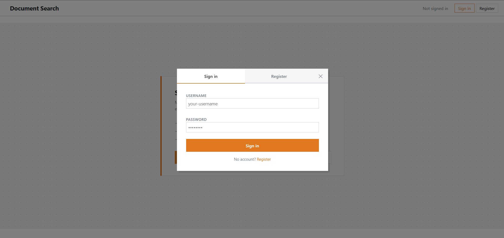

### 2. Upload the document

In the Upload Document section, click **Choose File**, select `test2.txt`, then click **Upload**.

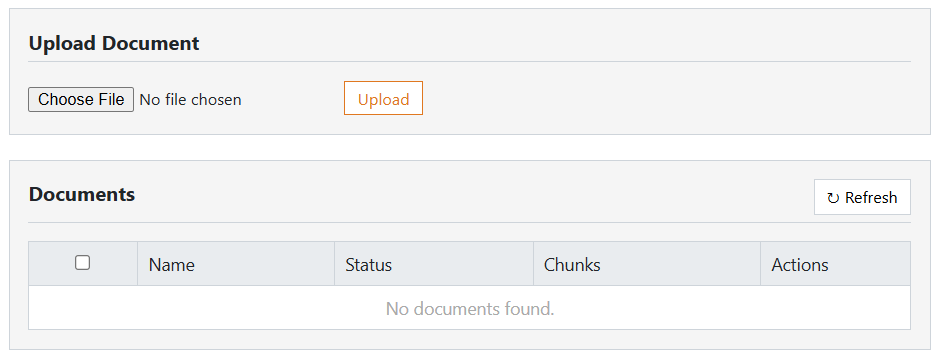

### 3. Wait for processing

The document will be indexed across all three embedding models. For a small document this takes 10–20 seconds. A larger document (200+ chunks) may take several minutes. Watch the **Documents** table — wait until the status turns green and says ready.

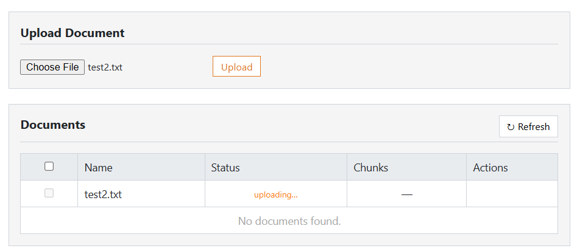

### 4. Render the document

Click the **Render** button next to the document name to display the full text. After a search, matched sentences will be highlighted in yellow.

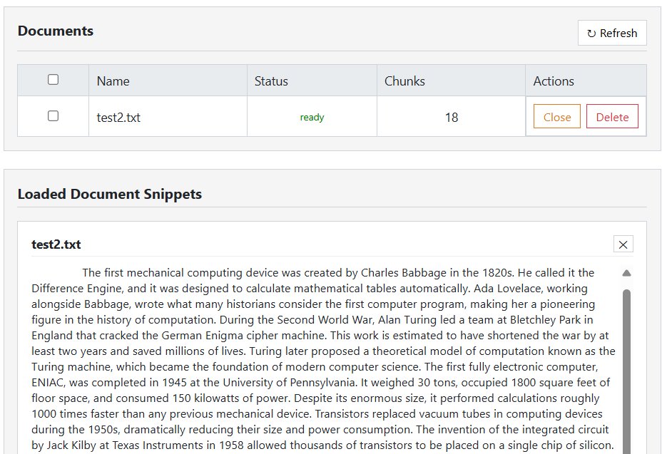

### 5. Configure search parameters

Fill in the search query and adjust the parameters as needed (e.g., choosing your model, Top K results, and Score Threshold).

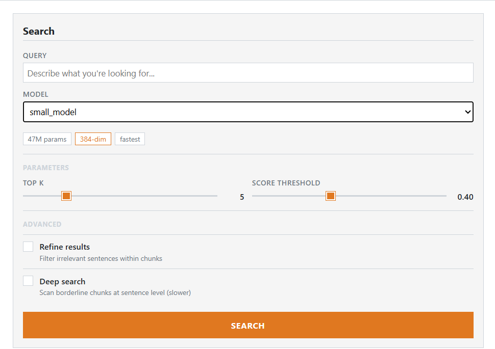

### 6. Run the search

Click **Search** to execute your query. The search results will populate at the bottom, displaying the similarity score and source filename. To see the matched sentences highlighted in yellow, click **Render** next to your document in the table.

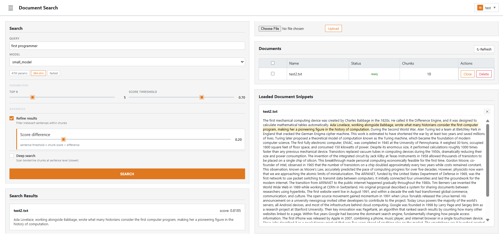

</details>

<details>
<summary>Search History</summary>

The app automatically saves your previous search requests so you can easily return to them later.

### Accessing Your History

To open your search history, click the burger menu (≡) in the top-left corner of the screen. This will slide out a sidebar displaying your past searches.

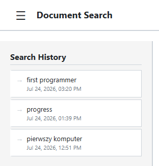

### Loading a Previous Search

Clicking on any search result from the history list will automatically restore your previous session. It will instantly fill in your previous parameters, populate the search results list, and apply the proper highlighting to the loaded document snippets.

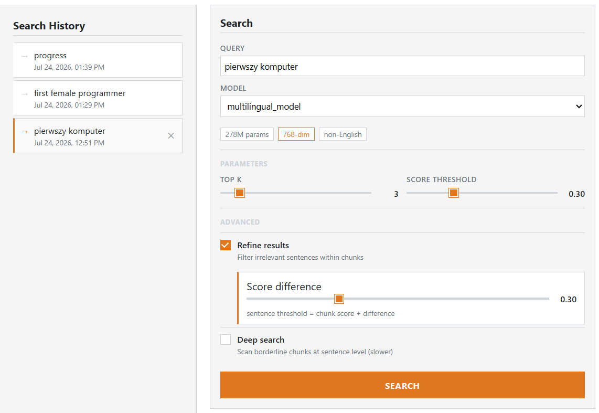
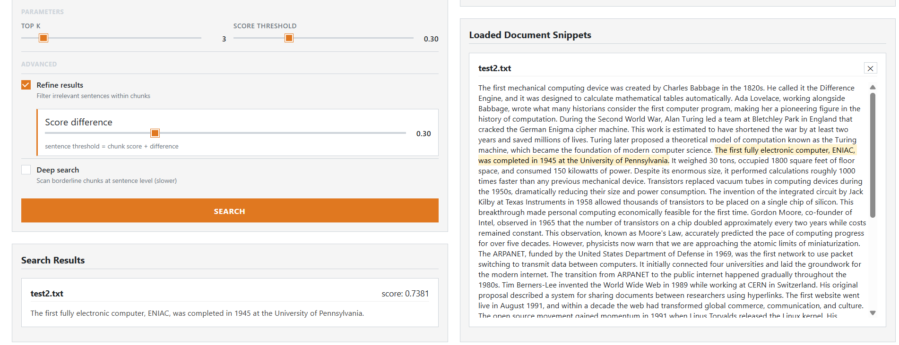

### Managing Your History

To keep your history clean, you can remove any saved search result. Simply click the "X" on the right side of the specific search item in the history list to delete it.

</details>

<details>
<summary>Manage Profile</summary>

Your account settings are accessible at any time from the top-right corner of the screen, without leaving your current search session.

### Accessing Your Profile

Click your username button in the top bar to open the account dropdown. It displays your role, registration date, last update, and current storage usage with a live progress bar showing how much of your quota is used.

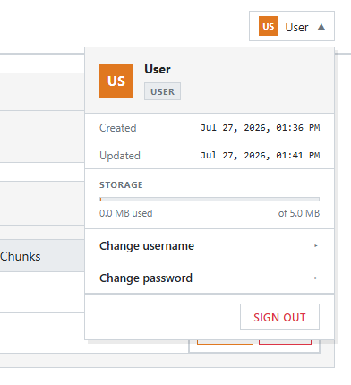

### Changing Your Username

Click **Change username** to expand the form, enter your new username, and press **Update username**. The top bar and account card will reflect the new name immediately.

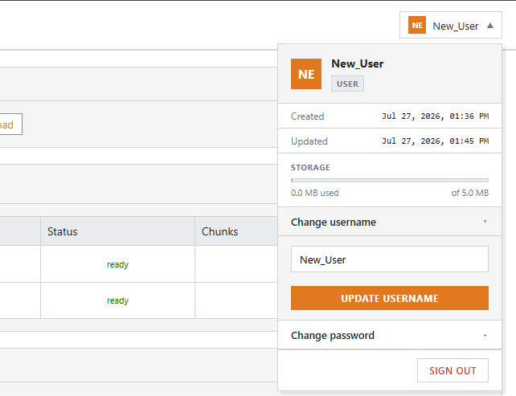

### Changing Your Password

Click **Change password** to expand the form. You will need to confirm your current password before setting a new one. Passwords must be at least 8 characters.
A confirmation message appears inline on success.

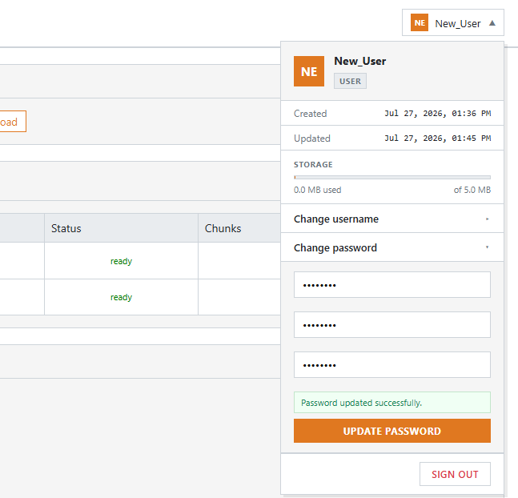

</details>

---

## Architecture

```
                  ┌─────────────────────────────┐
                  │           Browser           │
                  └──────────────┬──────────────┘
                                 │ HTTP :8080
                                 ▼
                  ┌─────────────────────────────┐
                  │         API Gateway         │
                  │      (serves frontend)      │
                  └──────────────┬──────────────┘
                                 │
       ┌─────────────────────────┼─────────────────────────┐
       ▼                         ▼                         ▼
┌──────────────┐          ┌──────────────┐          ┌──────────────┐
│ User Service │          │   Document   │          │    Search    │
│    :8003     │          │   Service    │          │    Service   │
│              │          │    :8001     │          │    :8002     │
└──────┬───────┘          └──────┬───────┘          └──────┬───────┘
       │                         │                         │
       │   ┌─────────────────────┴─────────────────────────┤
       ▼   ▼                                               │
┌──────────────┐                                           │
│  PostgreSQL  │                                           │
│   Database   │                                           │
│    :5432     │                                           │
└──────────────┘                                           │
                                                           │
                ┌──────────────────────────────────────────┘
                │
                ├─────────────────────────────────┐
                ▼                                 ▼
 ┌─────────────────────────────┐   ┌─────────────────────────────┐
 │        Model Service        │   │           Qdrant            │
 │    IBM Granite Embeddings   │   │       Vector Database       │
 │            :8000            │   │            :6333            │
 └─────────────────────────────┘   └─────────────────────────────┘
>>>>>>> c473231 (release: polish project and update documentation for v1.5.0)
```

---

### Services

| Service | Port | Description |
|---|---|---|
| gateway | 8080 | API gateway + frontend |
| model-service | 8000 | IBM Granite embedding inference |
| user-service | 8001 | User authentication, account management, and search history |
| document-service | 8002 | Document upload, indexing, retrieval |
| search-service | 8003 | Vector search with refine and deep search |
| qdrant | 6333 | Vector database |
| postgres | 5432 | Relational database for users, document metadata, and history |

### Embedding Models

| Model key | Model | Dims | Use case |
|---|---|---|---|
| `small_model` | granite-embedding-small-english-r2 | 384 | Fast, English |
| `normal_model` | granite-embedding-english-r2 | 768 | Accurate, English |
| `multilingual_model` | granite-embedding-278m-multilingual | 768 | Multilingual |

---

## Prerequisites

- [uv](https://github.com/astral-sh/uv) — Python package manager
- [Docker Desktop](https://www.docker.com/products/docker-desktop/)
- [Minikube](https://minikube.sigs.k8s.io/) _(for Kubernetes deployment)_
- [kubectl](https://kubernetes.io/docs/tasks/tools/) _(for Kubernetes deployment)_
- [Terraform](https://developer.hashicorp.com/terraform) _(for infrastructure provisioning)_
- [Helm](https://helm.sh/) _(for Kubernetes package management)_
- [ArgoCD](https://argo-cd.readthedocs.io/en/stable/) _(for GitOps deployment)_

---

## Running the Project

<details>
<summary>Option 1 — Local Development (Docker Compose)</summary>

#### Prerequisites

- Docker & Docker Compose

#### 1. Configure Environment

Copy the example environment file:

```bash
cp .env.example .env
```

> Modify secret keys and database credentials inside .env

#### 2. Start Services

Run Docker Compose to build and start all microservices:

```bash
docker compose up --build -d
```

#### 3. Access the Application

Open your browser and navigate to `http://localhost:8080`.

</details>

<details>
<summary>Option 2 — Kubernetes Deployment (GitOps with ArgoCD)</summary>

#### Prerequisites

- Minikube
- kubectl
- Helm
- Terraform
- ArgoCD

#### 1. Start Minikube

```bash
minikube start
```

#### 2. Install & Expose ArgoCD

Create the ArgoCD namespace and install the controller:

```bash
kubectl create namespace argocd
kubectl apply -n argocd -f [https://raw.githubusercontent.com/argoproj/argo-cd/stable/manifests/install.yaml](https://raw.githubusercontent.com/argoproj/argo-cd/stable/manifests/install.yaml)
```

Expose the ArgoCD server UI:

```bash
kubectl port-forward svc/argocd-server -n argocd 8888:443
```

> Access ArgoCD at https://localhost:8888

#### 3. Provision Infrastructure with Terraform

Copy the example Terraform variables file:

```bash
cp terraform/terraform.tfvars.example terraform/terraform.tfvars
```

> Modify secret keys, database and owner user credentials inside `terraform.tfvars`

Initialize and apply the Terraform configuration:

```bash
cd terraform
terraform init
terraform apply
```

Terraform will automatically create:

- The semantic-search Kubernetes namespace
- Kubernetes Secrets containing database credentials and JWT secret keys

#### 4. Deploy the Application via ArgoCD

Apply the ArgoCD Application manifest to begin the GitOps deployment:

```bash
kubectl apply -f argocd/argocd-app.yaml -n argocd
```

**ArgoCD** will automatically pull the **Helm chart** from GitHub, deploy all microservices to the semantic-search namespace, and maintain cluster synchronization.

#### 5. Access the Application

Expose the gateway service to route traffic:

```bash
kubectl port-forward svc/argocd-server -n argocd 8080:8080
```

Then open `http://localhost:8080` in your browser.

</details>

---

## API Endpoints

All endpoints are accessible through the gateway at `http://localhost:8080`.

| Method | Endpoint | Description |
| --- | --- | --- |
| `GET` | `/` | Frontend |
| `POST` | `/api/upload` | Upload and index a `.txt` document |
| `GET` | `/api/documents` | List all indexed documents |
| `GET` | `/api/document/{id}/text` | Retrieve full document text |
| `DELETE` | `/api/document/{id}` | Delete a document |
| `GET` | `/api/search` | Semantic search |
| `GET` | `/api/hostory` | Get whole search history |
| `DELETE` | `/api/history/{id}` | Delete a history record |

### Search parameters

| Parameter | Default | Description |
| --- | --- | --- |
| `query` | required | Search query |
| `model` | `small_model` | Embedding model to use |
| `top_k` | `5` | Number of results |
| `score` | `0.4` | Minimum similarity score |
| `refine` | `false` | Filter irrelevant sentences within chunks |
| `dif` | `0.05` | Sentence score threshold = score + dif |
| `deep` | `false` | Scan borderline chunks at sentence level |
| `deep_min` | `0.25` | Lower bound for borderline chunks |
| `document_ids` | none | Comma-separated list of document IDs to search within |

---

## Roadmap

- [x] **v1.0.0 — Core Search Engine**
  - Microservices architecture (Gateway, Document, Search, Model Services, Qdrant)
  - Vector search with 3 IBM Granite embedding models
  - Result refinement and deep search capabilities
  - Initial Docker Compose & Minikube deployment

- [x] **v1.5.0 — User Service, Auth & Account Management (Current)**
  - User authentication with JWT and PostgreSQL integration
  - Three-tier role hierarchy (owner / admin / user) with owner bootstrapped on first start
  - Per-role storage quotas enforced server-side on document upload
  - Account settings — username and password change
  - Persistent search history with full parameter and result replay, deletable entries
  - Redesigned UI — search panel with sliders, account dropdown, history sidebar
  - Automated deployment with Terraform, Helm, and ArgoCD
  - CI pipeline with GitHub Actions

- [ ] **v2.0.0 — Administration, Monitoring & CI**
  - Admin dashboard — user management, per-user stats, aggregate usage analytics
  - Owner dashboard — cluster metrics via Grafana and Loki (infrastructure level)
  - Expanded test suite — max coverage of unit, integration, and E2E tests
  - CI/CD transition to Jenkins with DockerHub registry

- [ ] **v3.0.0 — Agentic RAG & Cloud Deployment**
  - Migrate embedding models from HuggingFace to Ollama
  - AI Chat Assistant (Qwen 2.5) replacing static search as primary interface
  - Intelligent multi-query search — assistant operates on history, selects models, fans out queries
  - Chat-scoped document management and per-chat model selection
  - Cloud infrastructure deployment (AWS / Azure)

---

## Sources

- https://huggingface.co/ibm-granite/
- https://python-client.qdrant.tech/

---

## License

MIT
